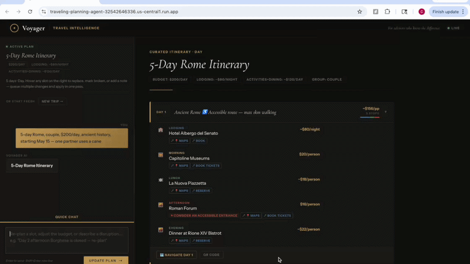
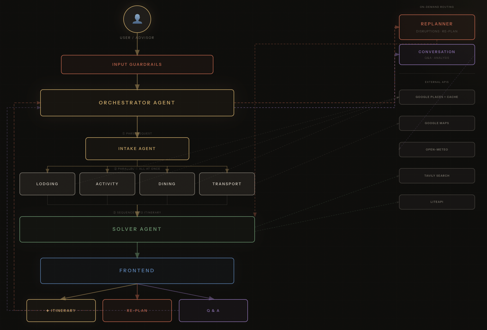

# Voyager — AI Travel Itinerary Optimizer
Collaborator: Chung-Yeh Yang(cy2816), Kuan-Ting Chen(kc3953)

A multi-agent system that builds constraint-valid, day-by-day travel itineraries from a single natural language request — and re-optimizes them instantly when plans change.

Built for the **Columbia IEOR Agentic AI for Analytics** capstone.

**Live demo:** https://traveling-planning-agent-32542646336.us-central1.run.app

---

## Demo

### Trip Planning


### Re-planning



### Pipeline Visualization



---

## Features

### Trip Planning
- **Natural language input** — describe a trip in plain text or use the structured Trip Builder form
- **Single-city & multi-city** — detects country/region requests ("Portugal 10 days") and splits nights across canonical city combinations (Lisbon 4n → Porto 3n → Algarve 3n)
- **Constraint-aware scheduling** — respects daily budget, opening hours, dietary restrictions, mobility needs, and must-see/must-exclude places
- **Transit-optimized routing** — uses Google Maps Route Matrix to minimize daily walking/transit time between stops
- **Weather-aware** — real 16-day forecast via Open-Meteo; historical climate averages beyond that window
- **Three slots per day** — morning · afternoon · evening, with a lunch and dinner each day

### Navigation & Booking
- Per-day **Google Maps route** — "Navigate Day N" opens a multi-stop route using real street addresses
- **QR codes** — scannable QR for each day's route, lazy-loaded on demand
- **Booking links** — hotel official sites, activity ticket links, and Maps search links per slot

### Re-planning
- Report a disruption and the system re-optimizes affected days instantly
- **Locked slots** are never moved by the re-planner
- Pulls from the already-fetched candidate pool — no redundant API calls

### Guardrails
- Off-topic requests rejected with a friendly message
- Impossible budgets (<$20 or >$10k/day) caught before planning starts

---

## Architecture

```
User message
 └─► Input Guardrails (off-topic · budget sanity)
      └─► OrchestratorAgent  [gemini-2.5-flash]
           ├─► IntakeAgent          → TripRequest + CityLeg list
           ├─► WeatherTool          → per-day forecast / historical avg
           ├─► LodgingAgent  ×city  → hotel candidates        (parallel)
           ├─► ActivityAgent ×city  → attraction candidates   (parallel)
           ├─► DiningAgent   ×city  → restaurant candidates   (parallel)
           ├─► TransportAgent       → inter-city options
           └─► SolverAgent          → Markdown itinerary
                                          ↓  (on disruption)
                                   ReplannerAgent
                                     1. parse_disruption   → DisruptionRequest (LLM)
                                     2. resolve_slots      → matched itinerary lines
                                     3. find_candidates    → cache-first replacements
                                     4. apply_swap         → patched text + ItineraryDelta
                                          ↓  (on question)
                                   ConversationAgent
```

**Agent framework:** OpenAI Agents SDK (`openai-agents`) — specialists exposed via `agent.as_tool()`
**Models:** `vertex_ai/gemini-2.5-flash` (orchestrator + solver) · `vertex_ai/gemini-2.0-flash` (specialists + replanner)
**Backend:** FastAPI · **Frontend:** Vanilla HTML/CSS/JS
**Places data:** Google Places API + local JSON cache + GCS bucket
**Routing:** Google Maps Routes API

---

## Agentic Concepts

### 1. Agentic Workflow
The orchestrator runs a multi-step, conditional loop — intake → weather → specialists → solver — with branching for re-planning and conversational Q&A. Each step depends on the output of the previous one.

- Orchestrator loop: [`backend/agents/orchestrator.py`](backend/agents/orchestrator.py)
- Orchestrator prompt with full flow spec: [`backend/agents/prompts/orchestrator.md`](backend/agents/prompts/orchestrator.md)

### 2. Multi-Agent System
Seven specialized agents collaborate, each owning a distinct concern. Lodging, activity, and dining agents run **in parallel** per city leg; the solver assembles their outputs into a single itinerary.

| Agent | File | Role |
|---|---|---|
| OrchestratorAgent | [`backend/agents/orchestrator.py`](backend/agents/orchestrator.py) | Routes requests, manages flow |
| IntakeAgent | [`backend/agents/intake.py`](backend/agents/intake.py) | Parses NL → TripRequest |
| LodgingAgent | [`backend/agents/lodging.py`](backend/agents/lodging.py) | Hotel search & ranking |
| ActivityAgent | [`backend/agents/activity.py`](backend/agents/activity.py) | Attraction search & ranking |
| DiningAgent | [`backend/agents/dining.py`](backend/agents/dining.py) | Restaurant search & ranking |
| SolverAgent | [`backend/agents/solver.py`](backend/agents/solver.py) | Schedules & formats itinerary |
| ReplannerAgent | [`backend/agents/replanner.py`](backend/agents/replanner.py) | Re-optimizes on disruption |
| ConversationAgent | [`backend/agents/conversation.py`](backend/agents/conversation.py) | Handles follow-up questions |

### 3. Tool Calling
Agents call typed function tools — Places search, weather forecast, routing, transport lookup, and context storage. All tools use Pydantic models for structured I/O.

| Tool | File | Purpose |
|---|---|---|
| `search_places` | [`backend/tools/places.py`](backend/tools/places.py) | Google Places API + cache |
| `get_weather_forecast` | [`backend/tools/weather.py`](backend/tools/weather.py) | Open-Meteo forecast / historical |
| `compute_route_matrix` | [`backend/tools/routing.py`](backend/tools/routing.py) | Google Maps route matrix |
| `get_transport_options` | [`backend/tools/transport.py`](backend/tools/transport.py) | Inter-city transport lookup |
| `store_delta` / `get_itinerary` | [`backend/tools/context_tools.py`](backend/tools/context_tools.py) | Read/write session context |
| `find_booking_url` | [`backend/tools/tavily_search.py`](backend/tools/tavily_search.py) | Booking link enrichment |
| `get_hotel_nightly_rate` | [`backend/tools/hotel_pricing.py`](backend/tools/hotel_pricing.py) | LiteAPI live hotel rates |

### 4. Context Engineering
Each agent receives a carefully crafted system prompt in Markdown. The orchestrator injects the live itinerary, locked slots, and weather data into every turn so all agents share the same state without a database.

- All system prompts: [`backend/agents/prompts/`](backend/agents/prompts/)
- Session state passed as `RunContext`: [`main.py` — `AppContext`](main.py#L120-L150)
- Guardrail agents for input validation: [`backend/guardrails/input_validation.py`](backend/guardrails/input_validation.py)

---

## Evaluation Results

### Planner Eval — 100% (46/46 checks, 8 cases)

| Case | Status | Time |
|---|---|---|
| Rome — single city, cached | ✅ PASS | 41.8s |
| Rome — mobility constraint (cane) | ✅ PASS | 39.6s |
| Lisbon + Porto — multi-city | ✅ PASS | 69.1s |
| Tokyo + Kyoto + Osaka — multi-city | ✅ PASS | 157.3s |
| Bangkok — budget backpacker | ✅ PASS | 45.7s |
| Florence — short art trip | ✅ PASS | 24.1s |
| Rome — no date, no weather | ✅ PASS | 39.2s |
| Rome — vegetarian dietary restriction | ✅ PASS | 34.8s |

Eval script: [`backend/tests/evals/run_planner_eval.py`](backend/tests/evals/run_planner_eval.py)
Golden cases: [`backend/tests/evals/golden_trips_full.json`](backend/tests/evals/golden_trips_full.json)

### Replanner Eval — 96% (57/59 checks, 9 cases)

| Case | Status | Time |
|---|---|---|
| Venue closed — no locks | ✅ PASS | 8.5s |
| Venue closed — with lock | ✅ PASS | 8.3s |
| Sick day — whole day lighten | ✅ PASS | 9.5s |
| Bad weather — outdoor → indoor | ✅ PASS | 24.6s |
| Budget cut mid-trip | ✅ PASS | 18.8s |
| Opportunity insertion (opera) | ⚠️ PARTIAL 6/7 | 9.2s |
| Multi-slot two locks | ✅ PASS | 13.0s |
| Group preference shift | ✅ PASS | 15.4s |
| Multi-city transit delay | ✅ PASS | 9.9s |

**Lock violations: 0 · Surgical edit failures: 0**

Replanner uses a deterministic 4-step pipeline: structured disruption parsing (LLM with Pydantic output) → slot resolution (regex) → parallel candidate lookup (cache-first) → text patching (regex swap). Response quality judged by LLM rather than keyword matching.

Eval script: [`backend/tests/evals/run_replan_eval.py`](backend/tests/evals/run_replan_eval.py)
Golden cases: [`backend/tests/evals/golden_disruptions.json`](backend/tests/evals/golden_disruptions.json)

---

## Setup

### Prerequisites
- Python 3.12+
- [`uv`](https://docs.astral.sh/uv/) package manager
- Google Cloud project with Vertex AI enabled
- Google Maps API key (Places + Routes)

### Install

```bash
git clone https://github.com/Olivery0307/Travel_Planning_Agent.git
cd Travel_Planning_Agent
uv sync
```

### Configure

```bash
cp .env.example .env
```

Edit `.env`:

```env
# LLM via Vertex AI
ORCHESTRATOR_MODEL=vertex_ai/gemini-2.5-flash
SPECIALIST_MODEL=vertex_ai/gemini-2.0-flash
SOLVER_MODEL=vertex_ai/gemini-2.5-flash      # stronger model for itinerary formatting
REPLANNER_MODEL=vertex_ai/gemini-2.0-flash
GOOGLE_CLOUD_PROJECT=your-gcp-project-id
GOOGLE_CLOUD_LOCATION=us-central1

# Google Maps & Places (one key works for both)
GOOGLE_MAPS_API_KEY=your-key
GOOGLE_PLACES_API_KEY=your-key

# Optional: GCS bucket for shared places cache
PLACES_CACHE_BUCKET=your-bucket-name

# Optional: booking link enrichment + hotel pricing
TAVILY_API_KEY=your-key
LITEAPI_KEY=your-key
```

### Run locally

```bash
uv run python main.py serve
```

Open [http://localhost:8000](http://localhost:8000).

### CLI (quick test without the UI)

```bash
uv run python main.py ask "5-day Rome trip, couple, $200/day, ancient history"
```

### Run evals

```bash
# Cached cities only (fast, no live API cost)
uv run python backend/tests/evals/run_planner_eval.py

# All cases including live Places API
uv run python backend/tests/evals/run_planner_eval.py --live

# Single case with full response output
uv run python backend/tests/evals/run_planner_eval.py --case rome_mobility --verbose
```

---

## Project Structure

```
.
├── main.py                              # FastAPI server + CLI entry point
├── pyproject.toml
├── Dockerfile
├── cloudbuild.yaml                      # GCP Cloud Build + Cloud Run deploy
├── static/
│   └── index.html                       # Single-page frontend
├── assets/
│   └── images/
│       └── pipeline.png                 # Pipeline architecture diagram
├── backend/
│   ├── agents/
│   │   ├── orchestrator.py
│   │   ├── intake.py
│   │   ├── lodging.py
│   │   ├── activity.py
│   │   ├── dining.py
│   │   ├── solver.py
│   │   ├── transport.py
│   │   ├── replanner.py
│   │   ├── conversation.py
│   │   └── prompts/                     # Markdown system prompts per agent
│   ├── tools/
│   │   ├── places.py                    # Google Places API + cache
│   │   ├── weather.py                   # Open-Meteo forecast
│   │   ├── routing.py                   # Google Maps Routes API
│   │   ├── transport.py                 # Inter-city transport lookup
│   │   ├── context_tools.py             # store_delta / get_itinerary tools
│   │   ├── tavily_search.py             # Booking link enrichment
│   │   ├── hotel_pricing.py             # LiteAPI nightly rates
│   │   ├── maps_links.py                # Maps URL builder + QR generator
│   │   └── cache.py                     # PlacesCache (local JSON + GCS)
│   ├── guardrails/
│   │   └── input_validation.py          # Off-topic + budget guardrails
│   ├── models/
│   │   ├── request.py                   # TripRequest, CityLeg
│   │   └── disruption.py                # ItineraryDelta
│   └── data/
│       ├── places_rome.json             # Pre-seeded places cache
│       ├── places_florence.json
│       ├── places_lisbon.json
│       ├── places_porto.json
│       ├── places_bangkok.json
│       └── places_algarve.json
├── backend/tests/
│   └── evals/
│       ├── run_planner_eval.py
│       ├── run_replan_eval.py
│       └── golden_trips_full.json
└── scripts/
    └── seed_places_cache.py             # Pre-fetch places for a new city
```

---

## Deployment

Deployed on **Google Cloud Run** via Cloud Build trigger on push to `main`.

```bash
# Deploy manually
gcloud run deploy traveling-planning-agent \
  --region=us-central1 \
  --image=us-central1-docker.pkg.dev/YOUR_PROJECT/... \
  --set-env-vars="ORCHESTRATOR_MODEL=vertex_ai/gemini-2.5-flash,SPECIALIST_MODEL=vertex_ai/gemini-2.0-flash,SOLVER_MODEL=vertex_ai/gemini-2.0-flash,REPLANNER_MODEL=vertex_ai/gemini-2.0-flash"
```

Required Cloud Run env vars: `ORCHESTRATOR_MODEL`, `SPECIALIST_MODEL`, `GOOGLE_CLOUD_PROJECT`, `GOOGLE_CLOUD_LOCATION`, `GOOGLE_MAPS_API_KEY`, `GOOGLE_PLACES_API_KEY`.
Optional: `SOLVER_MODEL`, `REPLANNER_MODEL`, `PLACES_CACHE_BUCKET`, `TAVILY_API_KEY`, `LITEAPI_KEY`.

---

## Seeding the Places Cache

Pre-fetch places for a new city to avoid live API calls during dev/eval:

```bash
uv run python scripts/seed_places_cache.py --city tokyo --country Japan
```

Upload to GCS so Cloud Run picks it up on next cold start:

```bash
gsutil cp backend/data/places_tokyo.json gs://your-bucket/places/tokyo.json
```
