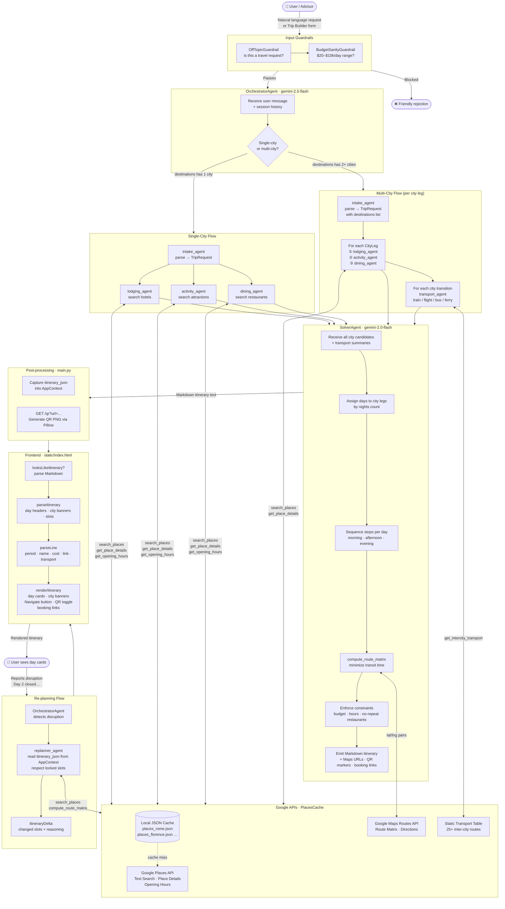

# Voyager — Itinerary Generation Pipeline

> Render this file in any Mermaid-compatible viewer (GitHub, VS Code Mermaid Preview, mermaid.live) to see the diagram.
> To export as PNG: paste the code block at https://mermaid.live → click Download PNG.

## Component summary

| Component | Model / Tech | Role |
|---|---|---|
| OrchestratorAgent | gemini-2.5-flash | Owns conversation; routes single vs multi-city; triggers re-plan |
| IntakeAgent | gemini-2.0-flash | Parses free text → `TripRequest` with `CityLeg` list |
| LodgingAgent | gemini-2.0-flash | Finds hotels per city via Google Places |
| ActivityAgent | gemini-2.0-flash | Finds attractions per city; flags booking-required |
| DiningAgent | gemini-2.0-flash | Finds restaurants (3× trip days to prevent repeats) |
| TransportAgent | gemini-2.0-flash | Inter-city transport via static lookup + fallback |
| SolverAgent | gemini-2.0-flash | Sequences all candidates into day-by-day Markdown itinerary |
| ReplannerAgent | gemini-2.0-flash | Re-optimizes disrupted days; respects locked slots |
| PlacesCache | Python / GCS | Local JSON cache → Google Places API on miss |
| Input Guardrails | gemini-2.0-flash | Off-topic filter + budget sanity check |
| Frontend parser | Vanilla JS | Parses Markdown into structured day cards |
